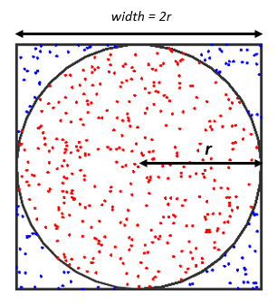

# Домашнее задание №7

## Задание 1

Напишите программу, в которой несколько потоков увеличивают общий счетчик на 1.

Напишите тесты: убедитесь, что счетчик потокобезопасен и использует классы `Atomic` для исключения состояния гонки.

## Задание 2

Реализуйте функцию, которая вычисляет факториал числа в многопоточном режиме при помощи `parallelStream`.

## Задание 3

Мы пишем специальный кэширующий сервис для поиска людей по атрибутам:
```java
public record Person(int id, String name, String address, String phoneNumber) {}

interface PersonDatabase {
    void add(Person person);
    void delete(int id);

    List<Person> findByName(String name);
    List<Person> findByAddress(String address);
    List<Person> findByPhone(String phone);
}
```
Сервис должен позволять найти человека только тогда, когда он стал доступен для поиска по любому из атрибутов, то есть невозможна ситуация, когда человека с **id=3** можно найти по имени, но нельзя по телефону.

Другими словами, человек появляется в поиске только тогда, тогда он доступен к поиску везде. Не может быть такого, что FindByX вернул что-то, а FindByY -- ничего.

Реализуйте задачу при помощи `synchronized`.

_В общем случае можно воспринимать эту задачу как разработку некоторой in-memory базы ключ-значение с наличием обратных индексов._

## Задание 3.5

В задачах кэширования часто есть дисбаланс между количеством чтений и записи.

Добавьте решение для предыдущей задачи на основе `ReadWriteLock`.

## Задание 4

Реализуйте расчет числа Пи, используя метод Монте-Карло и несколько потоков.



### [Онлайн-демо](https://demonstrations.wolfram.com/ApproximatingPiByTheMonteCarloMethod).

Реализуйте сначала однопоточную версию, а затем многопоточную. Для оптимальной производительности используйте количество потоков равное количеству ядер компьютера.

В ответе текстом приведите среднее время ускорения решения в зависимости от количества потоков, а так же уровень погрешности для симуляции в 10млн, 100млн и 1млрд симуляций.

Однопоточный алгоритм решения задачи:

1. Заведите переменные для подсчета общего числа точек (`totalCount`) и числа точек, попавших в круг (`circleCount`)
2. Сделайте цикл на N итераций (значение конфигурируется), чем больше итераций вы сделаете, тем точнее будет приближение:
   * создайте случайную точку в квадрате
   * проверьте, находится ли точка внутри круга, и если это так, то увеличиваете circleCount
   * увеличиваете totalCount
3. Вычислите приближение числа Пи как `4 * (circleCount / totalCount)`

В многопоточной версии пригодится класс `ThreadLocalRandom`: https://olka.github.io/blog/java_random_generators_perf/
