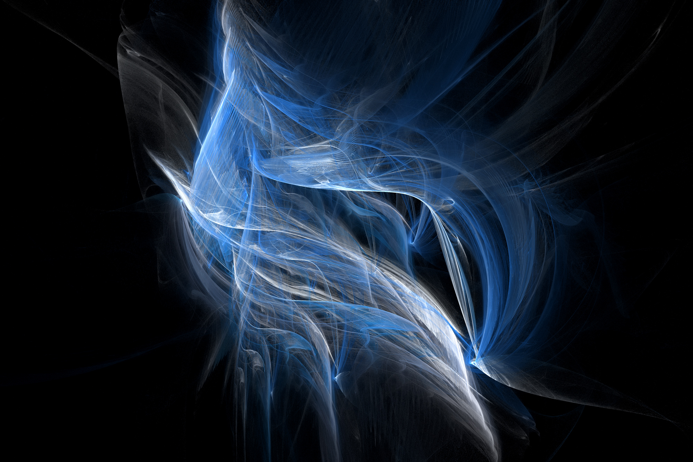

# Проект 4: фрактальное пламя

---
## Справочная информация

* Фрактальное пламя:
  * https://en.wikipedia.org/wiki/Fractal_flame
  * https://habr.com/ru/articles/251537

* Оригинальная статья (+ каталог вариаций): https://flam3.com/flame_draves.pdf
* Chaos Game:
  * https://en.wikipedia.org/wiki/Chaos_game
  * https://beltoforion.de/en/recreational_mathematics/chaos_game.php

* Описание СИФ с нуля: https://proproprogs.ru/fractals
* Онлайн демо: https://tariqksoliman.github.io/Fractal-Inferno


В этом задании ваша задача реализовать многопоточный генератор фрактального пламени:


### [Более крутые примеры](https://www.chaoticafractals.com/art/chaosfissure)

В основе алгоритма генерации фрактального пламени лежит **Chaos Game** (см оригинальную статью):

1. Случайным образом выбирается пиксель (x,y)
2. Производится _достаточное_ количество итераций:
   1. случайно выбирается вариация fi(x,y) из заранее заданного списка
   2. (x,y) := fi(x,y)
   3. увеличиваем счётчик "попаданий" в пиксель (x,y) (hit count)

---


## Задание

Ваша задача реализовать этот алгоритм и сделать его многопоточным.

_Совет: сначала сделайте функцию однопоточной, и после того, как все будет работать, делайте её многопоточной._

Ваша функция отрисовки должна принимать все конфигурируемые параметры как аргументы, например, размер изображения или коэффициенты трансформаций.

В результатах работы приведите примеры сравнения скорости работы однопоточной и многопоточной версии.

## Оценка

* Всего за проект можно получить 8 баллов
* +1 бонусный балл, если реализуете поддержку цветных изображений
* +1 бонусный балл, если реализуете поддержку логарифмической гамма-коррекции
* +1 бонусный балл, если вы добавите поддержку параметра симметрии
* +1 бонусный балл, если вы поделитесь вашим результатом в чате группы и вам поставят лайк (damn...)

---

## Иерархия классов

Это примерная иерархия. Как обычно, вы можете пользоваться ей, можете менять как вам угодно, а можете вообще не смотреть и делать задание самостоятельно :)
```java
// доменная модель, поверх которой работает алгоритм
public record Pixel(int r, int g, int b, int hitCount) { }
public record FractalImage(Pixel[] data, int width, int height) {  
public static FractalImage create(int width, int height) {}  
boolean contains(int x, int y) {}  
Pixel pixel(int x, int y) {}  
}

public record Point(double x, double y) {}
public record Rect(double x, double y, double width, double height) {  
boolean contains(Point p) {}  
}

// функция-преобразование
public interface Transformation extends Function<Point, Point> {}

// пост-обработка in-place, например, гамма-коррекция
@FunctionalInterface  
public  
interface ImageProcessor {  
void process(FractalImage image);  
}

// сохранение изображения на файловую систему
enum ImageFormat {JPEG, BMP, PNG}

public final class ImageUtils {  
private ImageUtils() {}

    void save(FractalImage image, Path filename, ImageFormat format) {}  
}
```
и псевдокод функции отрисовки
```java
// может быть несколько имплементаций интерфейса: однопоточный, многопоточный и т.п.
@FunctionalInterface  
public interface Renderer {
FractalImage render(FractalImage canvas, Rect world, List<Transformation> variations, int samples, short iterPerSample, long seed) {
for (int num = 0; num < samples; ++num) {
Point pw = random(world);

            for (short step = 0; step < iterPerSample; ++step) {
                Transformation variation = random(variations, ...);

                pw = transform(pw, ...);

                double theta2 = 0.0;
                for (int s = 0; s < symmetry; theta2 += Math.PI * 2 / symmetry, ++s) {
                    var pwr = rotate(pw, theta2);
                    if (!world.contains(pwr)) continue;

                    Pixel pixel = map_range(world, pwr, canvas);
                    if (pixel == null) continue;

                    // 1. делаем лок на время работы с пикселем  
                    // 2. подмешиваем цвет и увеличиваем hit count  
                }
            }
        }
    }
}
```
